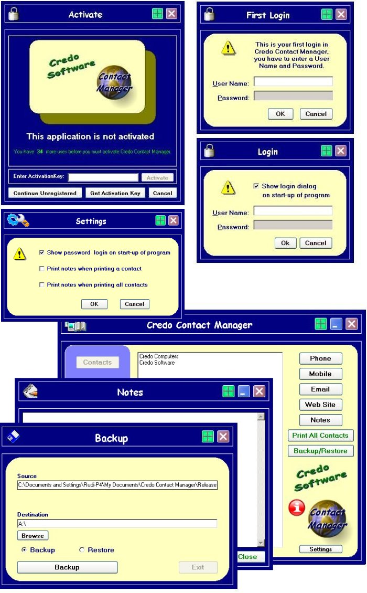



## Very Popular Contact Manager New Version Ver\. 2\.0\.1

### Description

A Complete Solution for Contact Management - Address Book. Credo Contact Manager Ver. 2.0.1 is an easy to use management software program. It has a build in trial, registration or activation solution. It is a password protected Contact Manager with the possibility to disable the password login. Also you can make notes of all your contacts with a build in text editor. You can backup all your contacts and notes. Email client and a phone dialer is also included (modem required). Web links of your contacts will take you straight to there web site. No database required. ... SOME BUG FIXED AND ADDED PRINTING OUT CONTACTS (SELECTED CONTACT, AND ALSO ALL CONTACTS).

----

Updated again on 03-12-2004 16:40 (UK time) BUG FIX PROGRAM START AFTER ACTIVATE.

----

Please rate this or give us feedback , so we can see if our code/software is useful and/or good.
 
### More Info
 

             |
---                |---
**Submitted On**   |2004-12-02 23:12:36
**By**             |[R Paret](https://github.com/Planet-Source-Code/PSCIndex/blob/master/ByAuthor/r-paret.md)
**Level**          |Advanced
**User Rating**    |4.3 (26 globes from 6 users)
**Compatibility**  |VB 6\.0
**Category**       |[Complete Applications](https://github.com/Planet-Source-Code/PSCIndex/blob/master/ByCategory/complete-applications__1-27.md)
**World**          |[Visual Basic](https://github.com/Planet-Source-Code/PSCIndex/blob/master/ByWorld/visual-basic.md)
**Archive File**   |[Very\_Popul1824811232004\.zip](https://github.com/Planet-Source-Code/r-paret-very-popular-contact-manager-new-version-ver-2-0-1__1-57517/archive/master.zip)

